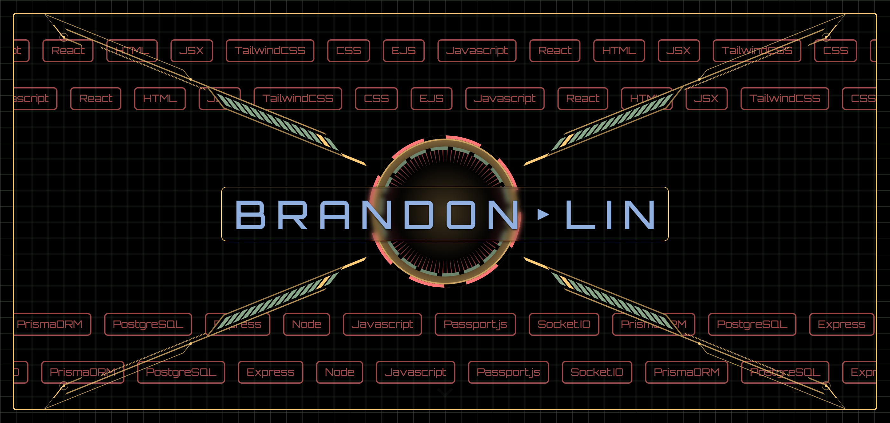

<h1 align="center">Portfolio Website</h1>
<h3 align="center">My personal website with my works, skills, and interests.
 <br/>
 Up to date as of November 20th 2025
 <br/>
 Click <a href='https://brandon-lin.netlify.app/' target="_blank">here</a> to check it out.
</h3>
<p align="center">
    
</p>

## Learning Outcomes

-   Deep dive into Framer Motion
    -   Learning to use variants
    -   Stagging animations
    -   Animation hooks / Motion values / useScroll
    -   Gestures (whileInView etc.)
    -   Animate presence wait mode (fade out -> wait for fade out to end -> render new component)
    -   Layout animations
-   First time implementing a Loading mask

### Retrospective aka yapping

Since this project didn't need a backend, I took the time to beef up my animation skills by reading through the entire framer motion react docs. I feel confident using Variants, Animation Presence, and gestures now! I would like more time practicing the various hooks and motion values though.

Regarding the design process, I would like to trust the process and myself a bit more. I am constantly thinking oh this doesnt look great oh what is this design until magically in the middle, somehow it starts looking good to me. Confidence can be increase by creating a finalized design (maybe i can learn figma) instead of a pen and paper draft. This would allow me to see the vision from earlier on. Also, I may need to create the content BEFORE creating the site; in doing so, I can plan the layout better as well.

## Start commands

```bash
# Start frontend react
cd client
npm install
npm run dev

# OR
cd client
npm install
npm run build
npm run preview
```
